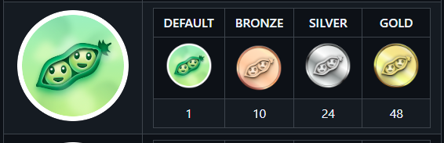

# ❤️HOW TO GET THE GOLDEN PAIR EXTRAORDINAIRE BADGE EASILY❓

How to get the Golden Pair Extraordinaire badge easily?


## Step 1️⃣: Install GitHub CLI

To get started, you need to install the GitHub CLI. Follow the instructions for your operating system:

### For macOS

```bash
brew install gh
```

### For Windows

You can download the installer from the [GitHub CLI releases page](https://github.com/cli/cli/releases).

### For Linux

Use the package manager for your distribution. For example, on Ubuntu:

```bash
sudo apt install gh
```

## Step 2️⃣: Authenticate with GitHub CLI

After installing, you need to authenticate with your GitHub account. You can do this using either a web-based login or a personal access token.

### Web-based Login

Run the following command:

```bash
gh auth login
```

Follow the prompts to authenticate via your web browser.

### Personal Access Token

If you prefer to use a personal access token, you can create one in your GitHub account settings. Then run:

```bash
gh auth login --with-token
```

Paste your token when prompted.

## Step 3️⃣ & 4️⃣: Define Co-authors' Names and Emails, Create and Merge Pull Requests

Create a script file (e.g., `create_prs.sh`) in the your local repository(if you don't have one, clone one or create new one then clone it.) and
And make sure there are `.envexample` file in the repository and dev and main branch.
Also you are on the dev branch.

If not you can run this command to create them.

```bash
touch .envexample
git checkout -b dev
git push -u origin dev
```

Then prepare your bash script file.
Define your co-authors' names and emails at the top of the script.

# (❗❗❗ Make sure this repository is public or you have to invite the co-authors to the repository before running the script.)

Then, add the following loop to create and merge pull requests 10 times:

```bash
#!/bin/bash

# Define co-authors' names and emails
COAUTHOR_1_NAME="John Doe"
COAUTHOR_1_EMAIL="john.doe@example.com"

COAUTHOR_2_NAME="Jane Smith"
COAUTHOR_2_EMAIL="jane.smith@example.com"

COAUTHOR_3_NAME="Alice Johnson"
COAUTHOR_3_EMAIL="alice.johnson@example.com"

# Loop to create and merge pull requests 10 times
for i in {1..10}
do
    # Make a change in the dev branch
    echo "NEW_ENV_VARIABLE='value'" >> .envexample

    # Step 2: Add changes to git
    git add .envexample

    # Commit with multiple co-authors using a here document
    git commit -F - <<EOF
Update .envexample for change #$i.

Co-authored-by: $COAUTHOR_1_NAME <$COAUTHOR_1_EMAIL>
Co-authored-by: $COAUTHOR_2_NAME <$COAUTHOR_2_EMAIL>
Co-authored-by: $COAUTHOR_3_NAME <$COAUTHOR_3_EMAIL>
EOF

    # Push changes to the dev branch
    git push origin dev

    # Create a pull request from dev to main using GitHub CLI
    pr_number=$(gh pr create --base main --head dev --title "Merge dev to main for change #$i" --body "Merging changes from dev to main for change #$i.")

    echo "Created pull request #$pr_number"

    # Merge the pull request
    gh pr merge $pr_number --merge
    echo "Merged pull request #$pr_number"

    # Optional: Wait for a short period to ensure timing
    sleep_duration=$((RANDOM % 3 + 1))  # Random sleep between 1 and 3 seconds
    echo "Sleeping for $sleep_duration seconds..."
    sleep $sleep_duration  # Sleep for the random duration
done
```

## Step 5️⃣: Run the Script

Make your script executable.

```bash
chmod +x create_prs.sh
```

Then whenever you want to get the badge, run the script:

```bash
./create_prs.sh
```

This will create and merge 10 pull requests from the `dev` branch to the `main` branch, with the specified co-authors.
So you can get the Golden Pair Extraordinaire badge easily by changing the end value of i to 48 at once on the above script.

# Is it easy? 😊

# I think so. 🤣

# Thank you for reading. 🤗
